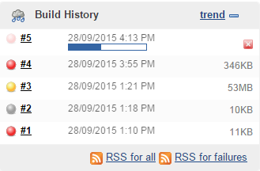
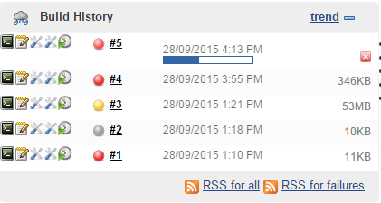

==============
 Hudson Icons
==============
Uses `Greasemonkey <https://addons.mozilla.org/en-US/firefox/addon/greasemonkey/>`_ (Firefox) / `Tampermonkey <https://chrome.google.com/webstore/detail/tampermonkey/dhdgffkkebhmkfjojejmpbldmpobfkfo?hl=en>`_ (Chrome)

Changes

To this

The links to:

- Console
- Raw Text Console
- Build Parameters
- Environment Variables
